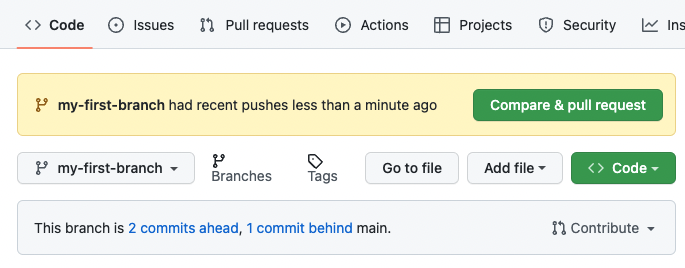
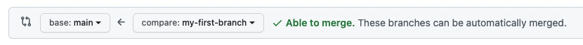
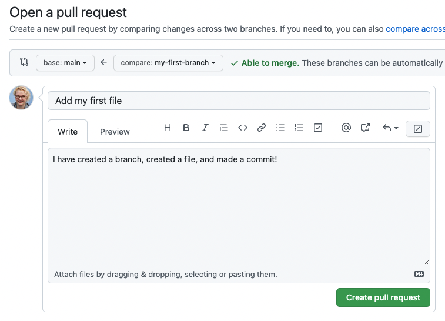
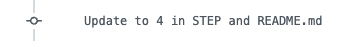

<!--
  <<< Author notes: Step 3 >>>
  Just a historic note: the previous version of this step forced the learner
  to write a pull request description,
  checked that `main` was the receiving branch,
  and that the file was named correctly.
-->

## Step 3: Open a pull request

_Nice work making that commit! :sparkles:_

Now that you have made a change to the project and created a commit, it’s time to share your proposed change through a pull request!

**What is a pull request?**: Collaboration happens on a _[pull request](https://docs.github.com/en/get-started/quickstart/github-glossary#pull-request)_. The pull request shows the changes in your branch to other people and allows people to accept, reject, or suggest additional changes to your branch. In a side by side comparison, this pull request is going to keep the changes you just made on your branch and propose applying them to the `main` project branch. For more information about pull requests, see "[About pull requests](https://docs.github.com/en/pull-requests/collaborating-with-pull-requests/proposing-changes-to-your-work-with-pull-requests/about-pull-requests)".

### :keyboard: Activity: Create a pull request

You may have noticed after your commit that a message displayed indicating your recent push to your branch and providing a button that says **Compare & pull request**.

To create a pull request automatically, click **Compare & pull request**, and then skip to step 6 below. If you don't click the button, the instructions below walk you through manually setting up the pull request.

1. Click on the **Pull requests** tab in the header menu of your repository.
2. Click **New pull request**.
3. In the **base:** dropdown, make sure **main** is selected.
4. Select the **compare:** dropdown, and click `my-first-branch`.

   

5. Click **Create pull request**.
6. Enter a title for your pull request. By default, the title will automatically be the name of your branch. For this exercise, let's edit the field to say `Add my first file`.
7. The next field helps you provide a description of the changes you made. Here, you can add a description of what you’ve accomplished so far. As a reminder, you have: created a new branch, created a file, and made a commit.

   

8. Click **Create pull request**. You will automatically be navigated to your new pull request.
9. Wait about 20 seconds then refresh this page (the one you're following instructions from). [GitHub Actions](https://docs.github.com/en/actions) will automatically update to the next step.

> [!NOTE]
> You may see evidence of GitHub Actions running on the tab with the pull request opened! The image below shows a line you might see on your pull request after the Action finishes running.
> 
> 
