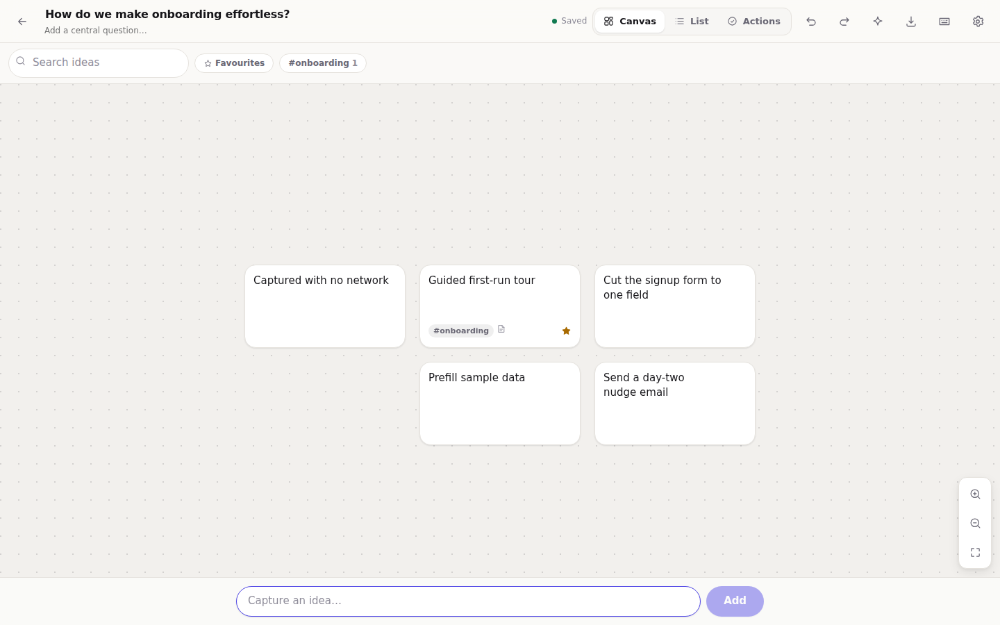

# Sparkboard

A personal brainstorming workspace: capture ideas fast, arrange them on a canvas,
group and tag them, mark the promising ones, and turn them into an action list.

Sparkboard is **local-first**. There is no account and no server. Everything you
write is stored in your browser's IndexedDB on the device you wrote it on, and the
whole app keeps working with no network connection. It installs as a Progressive
Web App on Android, iPhone, Windows and macOS, and runs in any modern browser.



## What it does

**Sessions**

- Create, rename and delete brainstorms
- Every change is saved automatically — there is no save button
- Reopen a previous session exactly as you left it, including the canvas viewport

**Ideas**

- Quick capture: one always-visible field, `Enter` to add, no forms or dialogs
- Inline `#tags` typed straight into the capture field
- Edit, duplicate, delete, reorder, and drag around a visual canvas
- Group related ideas; groups are drawn as frames on the board
- Tag, favourite, colour-code, and attach a longer note to any idea
- Search and filter by text, tag, group or favourite

**Three views of the same session**

- **Canvas** — spatial arrangement, pan, zoom, pinch, drag, fit-to-screen
- **List** — linear ordering with drag handles and keyboard reordering
- **Actions** — a simple checklist built from the ideas you decided to pursue

**Everything else**

- Light and dark themes, following the system by default
- Layouts designed separately for phone and laptop, not one shrunk into the other
- Keyboard shortcuts throughout on desktop; 44px+ touch targets on mobile
- Undo and redo, with an undo affordance on destructive actions
- Export to JSON (re-importable) or Markdown (readable); import from JSON
- Optional AI assistance that is off by default and separated from the core app

## Technology stack

| Concern | Choice |
| --- | --- |
| Language | TypeScript (strict) |
| UI | React 19 |
| Build | Vite 8 |
| Styling | Plain CSS with custom-property design tokens — no CSS framework |
| Persistence | IndexedDB via a small hand-written wrapper (`src/lib/db.ts`) |
| State | `useState` + a pure reducer (`src/lib/reducer.ts`) with snapshot-based undo |
| PWA | Hand-written service worker generated at build time by a local Vite plugin |
| Icons | Generated procedurally at build time by `scripts/generate-icons.mjs` |
| Tests | Vitest, over the pure domain modules |
| Lint | ESLint 9 flat config + typescript-eslint |

Runtime dependencies: `react` and `react-dom`. Nothing else. No state library, no
drag-and-drop library, no icon package, no IndexedDB wrapper, no Workbox.

## Getting started

You need [Node.js](https://nodejs.org) 20.19+ or 22.12+ and npm.

```bash
cd app
npm install       # install dependencies
npm run dev       # start the dev server on http://localhost:5173
```

### Production build

```bash
npm run build     # generates icons, typechecks, then builds into app/dist
npm run preview   # serve the production build locally
```

The service worker is only registered in production builds, so `npm run dev` never
serves stale code.

To host the app under a sub-path:

```bash
VITE_BASE=/introduction-to-github/ npm run build
```

### Publishing to GitHub Pages

`.github/workflows/deploy-sparkboard.yml` builds and publishes the app whenever
`app/**` changes on `main`. It enables Pages on its first run and passes the
correct base path automatically, so there is nothing to configure by hand.

The site then lives at:

```
https://<your-github-username>.github.io/<repository-name>/
```

Two things to know:

- The repository must be **public**, or the account must have GitHub Pages on a
  paid plan — Pages is not available for private repositories on the free tier.
- The `github-pages` deployment environment only accepts deploys from the default
  branch, which is why the workflow triggers on `main` rather than on a feature
  branch. Merge first, then it deploys.

You can also run it by hand from the repository's **Actions** tab
(*Deploy Sparkboard to Pages* → *Run workflow*).

### Checks

```bash
npm run typecheck   # tsc --noEmit
npm run lint        # eslint .
npm run test        # vitest run
npm run verify      # all of the above, then a production build
```

## Installing it as an app

Sparkboard must be served over HTTPS (or `localhost`) for installation to work —
that is a browser requirement for all PWAs. The in-app **Install** button shows
instructions tailored to the device you are on.

### Android — Chrome, Edge, Samsung Internet

1. Open Sparkboard in the browser.
2. Tap the **⋮** menu.
3. Choose **Install app** (or **Add to Home screen**) and confirm.

Chromium browsers also show an install prompt in the app itself once you have used
it briefly.

### iPhone and iPad — Safari

1. Open Sparkboard **in Safari**. iOS only supports installing from Safari; Chrome
   and Firefox on iOS cannot add a web app to the Home Screen.
2. Tap the **Share** button.
3. Scroll down, tap **Add to Home Screen**, then tap **Add**.

iOS has no automatic install prompt, so this step is manual by design — the app
cannot trigger it. Once added, Sparkboard runs full-screen and works offline.
See the storage note below for an iOS-specific caveat.

### Windows — Chrome or Edge

1. Click the **install icon** at the right-hand end of the address bar, or
2. Open the **⋮** menu and choose **Install Sparkboard**.

You get a standalone window, a taskbar entry and a Start menu shortcut.

### macOS

- **Safari**: choose **File → Add to Dock**.
- **Chrome / Edge**: use the install icon in the address bar, or **⋮ → Install Sparkboard**.

The app then launches in its own window from the Dock or Launchpad.

## How offline storage works

- All content lives in an IndexedDB database called `sparkboard`, in four object
  stores: `sessions`, `ideas`, `groups` and `actions`.
- Writes are debounced by ~350 ms and then committed in **one transaction per
  session**, so an interrupted save can never leave a session half-written. The
  app also flushes immediately when the page is hidden or closed, which is what
  protects the last few keystrokes when you switch apps on a phone.
- The app shell (HTML, JS, CSS, manifest, icons) is precached by a service worker
  keyed to the build hash. Navigation is served from that cache, so the app opens
  offline. Other same-origin requests use stale-while-revalidate. Cross-origin
  requests are never cached.
- When a new version is deployed, the new service worker installs and **waits**.
  The app shows a "new version is ready" banner and only swaps over when you
  choose to reload — your work is never interrupted mid-thought.
- Theme choice and optional AI settings live in `localStorage`; brainstorming
  content never does.

**What can delete your data:** clearing site data or browser storage, uninstalling
the browser, or "Clear all local data" in Settings. On iOS, Safari may evict
storage for web apps that go unused for several weeks. Export a backup now and
then if the work matters.

## Export and restore

From the home screen or from **Settings → Your data**:

- **Export all** writes a single JSON file containing every brainstorm.
- **Import** reads that file back. Imports are always added as *copies* with fresh
  ids, so importing never overwrites what is already on the device.

From inside a session (the download icon in the top bar):

- **JSON** — lossless and re-importable: positions, groups, tags, notes, actions.
- **Markdown** — readable: topic, grouped ideas, notes, tags, promising ideas and
  the action checklist.
- **Copy as Markdown** — the same content straight to the clipboard.

The importer is defensive: unknown or corrupt entries are dropped rather than
failing the whole import, and a file from a newer version of the app is refused
with a clear message instead of being partially applied.

## Optional AI assistance

The core app has no AI in it at all, and nothing in `src/ai` can write to a session
— it only returns suggestions that you accept explicitly.

Two providers are available:

- **On-device assistant** (default, always available). Structured ideation
  technique — SCAMPER lenses, assumption challenges, question ladders — applied to
  your own wording, plus token-overlap clustering and a session summary. It runs
  entirely in the browser and works offline. Nothing is uploaded.
- **Your own AI endpoint** (off by default). If you enable it in **Settings → AI**
  and supply an OpenAI-compatible base URL, model name and optional key, requests
  go to `{base URL}/chat/completions`. **Content sent this way leaves your device**,
  and the UI says so wherever the option appears. Sparkboard ships with no
  credentials and contacts no model service unless you configure one.

## Keyboard shortcuts

Press <kbd>?</kbd> in a session for the full list. The essentials:

| Key | Action |
| --- | --- |
| <kbd>N</kbd> | Focus quick capture |
| <kbd>/</kbd> | Focus search |
| <kbd>1</kbd> <kbd>2</kbd> <kbd>3</kbd> | Canvas / List / Actions |
| <kbd>F</kbd> | Favourite the selection |
| <kbd>D</kbd> | Duplicate the selection |
| <kbd>G</kbd> | Group the selection |
| <kbd>A</kbd> | Send the selection to the action list |
| <kbd>Delete</kbd> | Delete the selection |
| <kbd>Ctrl/⌘</kbd> + <kbd>Z</kbd> | Undo (add <kbd>Shift</kbd> to redo) |
| <kbd>Esc</kbd> | Close the panel, clear filters, or deselect |

On the canvas: drag the background to pan, <kbd>Ctrl</kbd> + scroll (or pinch) to
zoom, double-click empty space to drop an idea there.

## Project layout

```
app/
├── index.html                    app shell, theme bootstrap, meta tags
├── public/
│   ├── manifest.webmanifest      PWA manifest
│   └── icons/                    generated PNG icons + SVG favicon
├── scripts/
│   ├── generate-icons.mjs        dependency-free PNG icon generator
│   └── vite-plugin-service-worker.ts   emits sw.js with a real precache manifest
└── src/
    ├── ai/                       optional assistance, isolated from the core
    ├── components/               React components
    ├── lib/                      domain: types, db, repository, reducer, search,
    │                             export/import, markdown, layout, pwa, theme
    │   └── __tests__/            Vitest suites over the pure modules
    ├── state/                    app context, autosave, routing, theme, toasts
    └── styles/                   design tokens, base, components, screens
```

## Licence

MIT — see [../LICENSE](../LICENSE).
